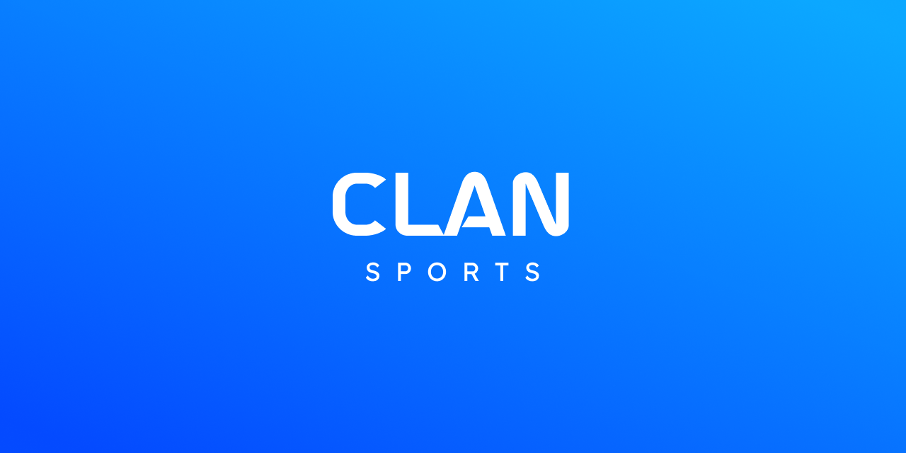

<h1 align="Center">

</h1>

## Project Description
**Clan Sports** es un proyecto que desarrollado por la comunidad de @codigouranio que busca brindar la oportunidad a un niño y niña, de
mostrar todos y cada uno de sus logros deportivos durante su etapa juvenil dando a conocer objetivos como:

**Clan Sports** is a project developed by the @codigouranio/clan.sports community that seeks to provide the opportunity for the 
children's, to show each and everyone of your sporting achievements during your youth stage, revealing goals: 

- Competitive Goals
- Images where there was an important participation by you or your children's
- Support and publicize their recognitons validated by the sports institutions that validate and certificate said

<!-- Primer posible mensaje de brindar nuestros servicios -->
**Clan Sports** we want to provide our users a platform, which you want to fulfill as a social network where you or 
your children's will manage their academic sports achievements. So we can provide the opportunity the
educational institutions know their performance and with the **Clan Sports** help provide the ease of contact with you,
and give the chance for you to grow bot personally and professionally in your life.

<!-- Segundo posible mensaje de brindar nuestros servicios -->
_**Clan Sports** we want to provide for you or your childern's, your family, sports institutions with the facility
to verify, know the children performance, achievements, and recognition that each of the children's have achieved with
their effort. We believe that every children is giving their best to grow and enjoy their favorite sport, that is 
why it is time to make them known and even support the growth of the children's._

## Features
Estamos analizando posibles nuevas funciones, este proyecto se esta empezando a desarrollar. Cuando este proyecto 
sea lanzado y demostrado por primera vez empezaremos a plantearnos actualizaciones.
We are analyzing possible new features. Because this project starting to develop. When this project is released for
first time, we will start considering more features and updates.

<h1 align="Center"><strong>COMING SON!!!</strong></h1>

